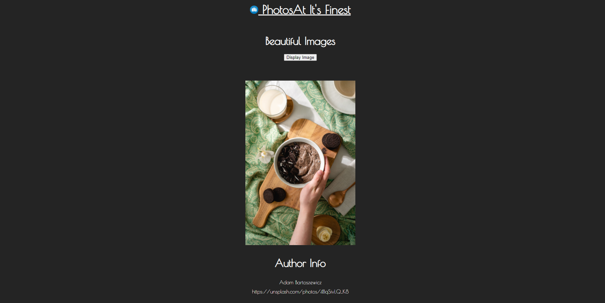

# Project MVP
## Photo's at it's Finest
    - A site which feeds photos from Unsplash API. Each photo will return a picture with the author information and a URL to the author's direct photo. 
### Techologies Used
    - Javascript
    - CSS
    - HTML
    - Logo Generators
    - Google Fonts
    - 3rd Party CSS files

### Getting Started
- 
    [Link to my site: Photo's At It's Finest](https://animated-banoffee-886a7f.netlify.app/)

### Future Enhancements
- Search ability within the page
- Have different information populate (such as author's personal portfolio) load in to each picture container
- Have random/search/cache of new photos within same page
- Better styling 